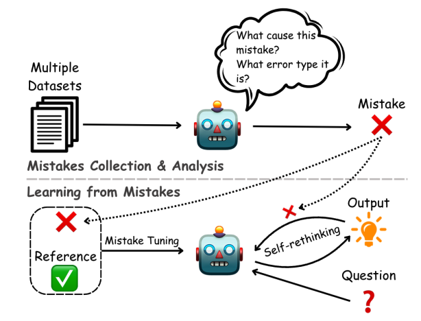
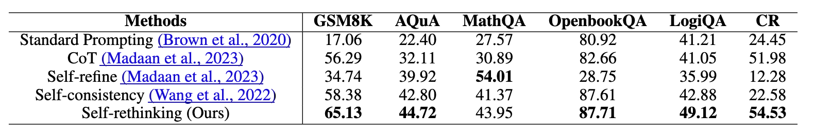
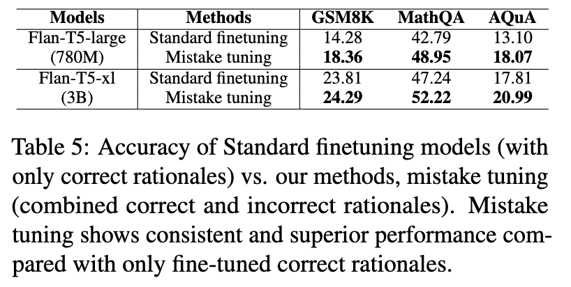

## Summary

This paper delves into the capacity of Large Language Models (LLMs) to learn from their errors, especially in tasks requiring reasoning. It introduces **COTERRORSET**, a novel benchmark comprising questions designed to elicit both correct responses and errors. The research presents two innovative approaches:

- **Self-Rethinking Prompting**: Encourages models to reconsider their answers upon making similar errors.
- **Mistake Tuning**: Involves fine-tuning the models using both correct and incorrect examples.

These methods aim to harness the educational potential of errors, with the goal of refining the reasoning abilities of LLMs by analyzing the nature and causes of their mistakes.

## Methodology

### Dataset: COTERRORSET
This dataset is curated by engaging with the LLM PaLM2 in a unique process:

1. PaLM2 is requested to answer questions and provide justifications.
2. Both accurate answers and errors are then fed back to PaLM2, prompting it to reflect on and explain its mistakes. These explanations form the COTERRORSET benchmark.

### Approaches
The paper outlines the concepts of **Self-Rethinking** and **Mistake Tuning**. Initially, the relationship between these two strategies appears unclear. However, Figure 1 suggests a sequential application: Mistake Tuning is followed by Self-Rethinking.

#### Self-Rethinking
This involves a "backward-checking" phase, where the LLM reviews its reasoning process, specifically focusing on previously identified error types. Although not extensively detailed, this phase implies that the LLM reassesses and corrects its reasoning without external input.

#### Mistake Tuning
The essence of this approach is straightforward: it employs two prefixes, "[CORRECT RATIONALE]" and "[INCORRECT RATIONALE]", for fine-tuning the model on both accurate and erroneous justifications. This method, despite its simplicity, raises questions about its elegance and effectiveness.

## Results

## Comments
1. The concept of Self-Rethinking closely mirrors the "Reflexion" approach outlined by Shinn et al., 2023, albeit in a more foundational form.
2. Despite Figure 1 suggesting the potential for integrating both approaches, the experimental design treats them separately.
3. Evaluating these strategies independently may dilute the perceived significance of the study's contributions.
